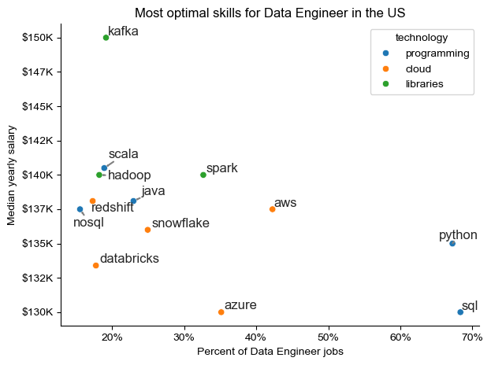

# Overview

Welcome to my data job market analysis.
This project was created to better understand and navigate the data job landscape, highlighting the top-paying and most in-demand skills to help identify strong opportunities for data professionals. The dataset comes from Luke Barousse’s Python Course, which includes detailed information regarding different data jobs.

Using Python, I analyze questions such as:

- Which skills are most in demand?
- What are the current salary trends?.
- Where do high demand and high pay     intersect in data analytics?
###
### Tools & Technologies
For this deep dive into the data job market, I leveraged a range of tools to analyze, visualize, and manage the project:

- Python: The core language driving the analysis and insights.
- Pandas: For data cleaning and analysis.
- Matplotlib: For creating clear and informative visualizations.
- Seaborn: For producing more advanced and visually appealing plots.
- Jupyter Notebooks: Used to run Python scripts and document findings interactively.
- Visual Studio Code: My primary editor for writing and running Python scripts.
- Git & GitHub: Used for version control and collaboration, ensuring smooth project tracking and sharing.

### Data Preparation and Cleanup

This section outlines the steps taken to prepare the data for analysis, ensuring accuracy and usability by importing necessary libraries, loading the dataset and cleaning  the data to ensure its quality.

``` python
# Importing Libraries
import ast
import pandas as pd
import matplotlib.pyplot as plt
import seaborn as sns 

# Loading Data
df = pd.read_csv("C:/Users/JK_al/OneDrive/Escritorio/Datos_2025/job_postings_flat.csv")

# Data Cleanup
df['job_posted_date'] = pd.to_datetime(df['job_posted_date'])
df['job_skills'] = df['job_skills'].apply(lambda x: ast.literal_eval(x) if pd.notna(x) else x)
```

### Filter US Jobs
To focus my analysis on the U.S. job market (due to the most amount of data from the dataset), I apply filters to the dataset, narrowing down to roles based in the United States.

###

# Analysis

Each Jupyter notebook for this project aimed at investigating specific aspects of the data job market. Here’s how I approached each question:

### What are the most demanded skills for the top 3 most popular data roles?

To identify the most in-demand skills for the top three data roles, I first filtered the dataset to find the most common job titles. Then, for each of these roles, I extracted the top five skills.
This analysis reveals which skills are most valued for each position—helping to pinpoint where to focus skill development based on the target role.


View my notebook with detailed steps here:
[2.Skill_Demand.ipynb](3_project/2.Skill_Demand.ipynb)

### Results


*Graph visualizing the salary for the top 3 data roles and their top 5 skills associated with each.*

### Insights

Across all three roles, technical programming and database skills (especially SQL and Python) stand out as the most in-demand. This shows that a strong foundation in these two languages is essential for anyone pursuing a career in data.

1. SQL and Python are universally essential — mastery of both provides versatility across all data roles.
2. Visualization and communication skills (Tableau, Power BI) remain vital, particularly for analysts.
3. Cloud and big data tools (AWS, Azure, Spark) are becoming standard for engineering roles.
4. The Data Scientist role continues to demand the most technical diversity — blending programming, statistics, and visualization.

###

## What are in-demand skills trending for Data Engineer?

To explore skill trends for Data Engineers until 2025, I filtered the dataset for data engineer positions and grouped the associated skills by the month of each job posting. This analysis highlights the top five skills per month, revealing how their behaviour changed throughout the year.

View my notebook with detailed steps here:
[3.Skills_Trend.ipynb](3_project/3.Skills_Trend.ipynb)

### Results


*Bar graph visualizing the trending top skills for data analysts in the US in 2025.*

### Insights

It can be noticed that SQL and Python consistently remain the core skills for Data Engineers throughout 2024, with both maintaining high demand (around 60–70% of job postings).

Meanwhile, cloud and big data technologies like AWS, Azure, and Spark show gradual growth and periodic spikes, reflecting the industry's ongoing shift toward cloud-based infrastructure and distributed data processing.

Overall, the trend highlights that while SQL and Python are foundational, cloud and big data expertise increasingly differentiates competitive candidates in the Data Engineering job market.
###

## How well do other job roles pay compare to Data Engineer?

To uncover the highest-paying roles and skills, I focused on job postings from the United States and analyzed their median salaries. Before narrowing down to specific skills, I examined the salary distributions of common data roles—such as Data Scientist, Data Engineer, and Data Analyst— to gain insight into which positions offer the highest compensation.


View my notebook with detailed steps here:
[4.Salary_analysis.ipynb](3_project/4.Salary_analysis.ipynb)

### Results


*Box plot visualizing the salary distributions for the top 6 data job titles.*

### Insights

This chart shows a clear salary hierarchy within data roles in the U.S. — senior positions consistently earn more than their mid-level counterparts. Overall, the data highlights that specialization and seniority significantly boost earning potential, with engineering and data science roles offering the most lucrative career paths in the U.S. data market.

Regarding Data Engineering is a data job well-paying and a high-demand field within the data ecosystem. It combines strong baseline salaries with opportunities for rapid growth, making it one of the most financially rewarding career paths for professionals skilled in data infrastructure, cloud technologies, and data pipelines.
###

## What are the top most popular skills for Data Engineer and how well they pay in comparison with more advanced skills?

Next, I narrowed the analysis to focus exclusively on Data Analyst roles. I examined both the highest-paying and most in-demand skills, visualizing the results through two bar charts for easy comparison.

View my notebook with detailed steps here:
[4.Salary_analysis.ipynb](3_project/4.Salary_analysis.ipynb)

### Results


*Two separate bar graphs visualizing the highest paid skills and most in-demand skills for data engineer in the US.*

### Insights

The highest-paid skills (like Planner, Solidity, Mongo...) are specialized or niche technologies, suggesting that scarcity and specialization drive up compensation.

In contrast, the most in-demand skills (like SQL, Python, AWS, Azure, and Spark) are foundational and widely used across data engineering, reflecting their importance in day-to-day work.

Overall, high salaries tend to align with emerging or specialized skills, while job security and demand come from mastering core data technologies. For Data Engineers, the optimal strategy is to build a strong foundation in high-demand tools (SQL, Python, cloud platforms) and supplement it with niche or cutting-edge expertise to maximize earning potential.
###

## What is the most optimal skill to learn for Data Engineer?

To determine the most valuable skills to learn—those that are both high-paying and highly in demand— I calculated each skill’s demand percentage and median salary. This allowed me to pinpoint which skills offer the best balance between demand and compensation.

View my notebook with detailed steps here:
[5.Optimal_skills.ipynb](3_project/5.Optimal_skills.ipynb)

### Results


*A scatter plot visualizing the most optimal skills (high paying & high demand) for data engineer in the US with labeling by technologies.*

### Insights

For Data engineering, SQL and Python are the most in-demand skills, appearing in over half of job postings while Kafka, Scala, and Spark stand out as high-paying yet less common skills, suggesting that specialized expertise in these technologies can significantly boost earning potential.

Cloud tools like AWS, Azure, and Snowflake offer a strong mix of high demand and competitive pay, underscoring their importance in modern data infrastructure.

In overall, the most optimal skill set for a Data Engineer blends foundational tools (SQL, Python) with high-value technologies (Kafka, Spark, and cloud platforms) — combining widespread demand with strong salary upside.
###
# What I Learned
Throughout this project, I gained a deep understanding of the data engineer job market while advancing my Python proficiency, particularly in data manipulation and visualization.

Here are some key insights I took away:
- Advanced Python Application: Leveraged libraries like Pandas for data manipulation. Seaborn and Matplotlib for visualization, enabling more efficient and insightful analyses.
- The Value of Data Cleaning: Discovered the critical role of thorough data cleaning and preparation in ensuring the reliability and accuracy of analytical results.
###

# Final insights
This project revealed several key insights about the data job market for data engineers:

- Skill Demand and Salary Relationship: There is a strong link between the demand for specific skills and the salaries they command.
- Evolving Market Trends: The demand for data skills continues to shift, reflecting the dynamic and fast-changing nature of the industry. Staying up to date with these trends is crucial for sustained career growth.
###

# Challenges
This project came with its share of challenges, each offering valuable learning experiences:

- Data inconsistencies: Managing missing or inconsistent data required careful handling and robust cleaning techniques to maintain analytical accuracy and data integrity.
- Complex Data Visualization: Creating clear and engaging visuals for complex datasets was challenging but essential for effectively communicating key insights.
###

# Conclusion

This exploration of the data engineer job market has been highly insightful, revealing the key skills and trends driving this ever-evolving field. The findings not only deepened my understanding but also offer practical guidance for anyone seeking to grow their career. This project serves as a strong foundation for future research and highlights the importance of continuous learning and adaptability in the world of data.
