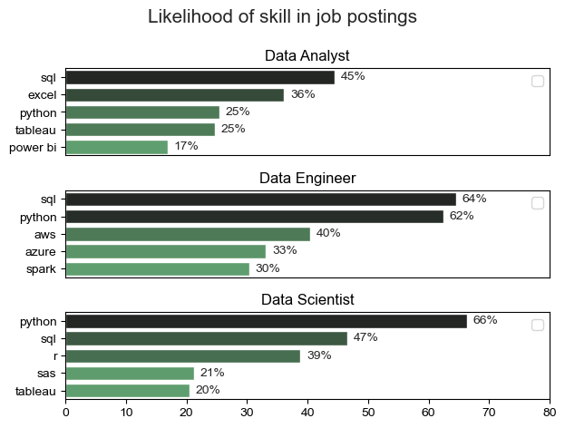
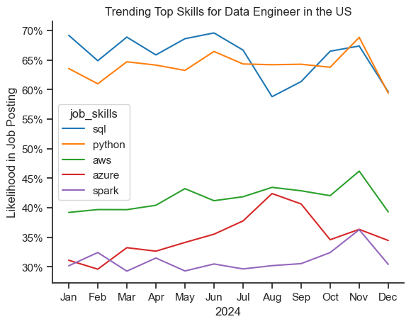
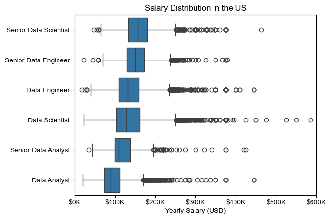
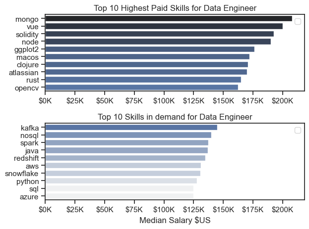

# The analysis

## What are the most demanded skills for the top 3 most popular data roles?

Realiza el analisis

View my notebook with detailed steps here:
[2.Skill_Demand.ipynb](3_project/2.Skill_Demand.ipynb)

## Results

### Insights

Escribe las conclusiones (Puedes usar gpt al mostrarle la grafica y pedir que se puede concluir (holistic insights))

# The analysis

## What are in-demand skills trending for Data Engineer?

Realiza el analisis

View my notebook with detailed steps here:
[3.Skills_Trend.ipynb](3_project/3.Skills_Trend.ipynb)

## Results

### Insights

Escribe las conclusiones (Puedes usar gpt al mostrarle la grafica y pedir que se puede concluir (holistic insights))

# The analysis

## How well do other job roles pay compare to Data Engineer?

Realiza el analisis

View my notebook with detailed steps here:
[4.Salary_analysis.ipynb](3_project\4.Salary_analysis.ipynb)

## Results

### Insights

Escribe las conclusiones (Puedes usar gpt al mostrarle la grafica y pedir que se puede concluir (holistic insights))

# The analysis

## What are the top most popular skills for Data Engineer and how well they pay in comparison with more advanced skills?

Realiza el analisis

View my notebook with detailed steps here:
[4.Salary_analysis.ipynb](3_project/4.Salary_analysis.ipynb)

## Results

### Insights

Escribe las conclusiones (Puedes usar gpt al mostrarle la grafica y pedir que se puede concluir (holistic insights))